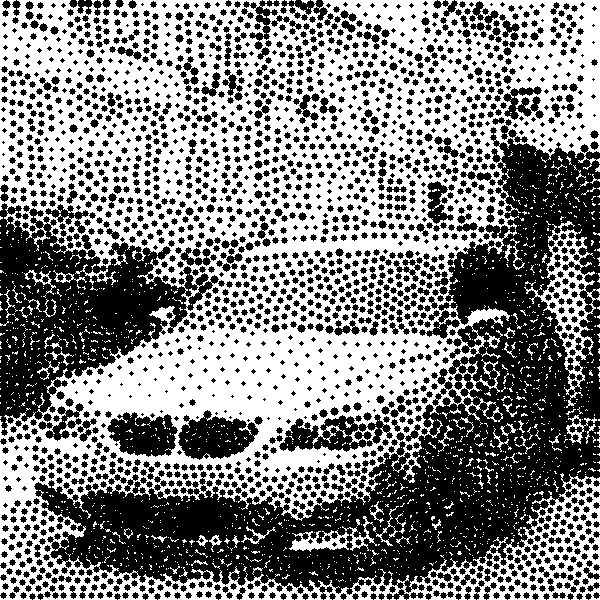
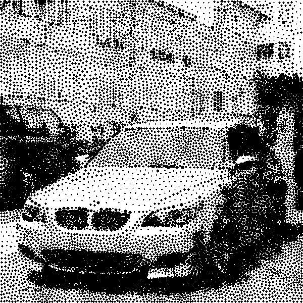
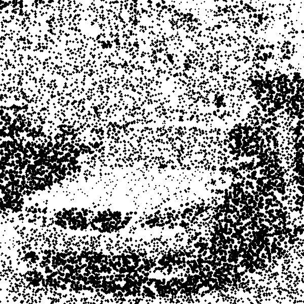
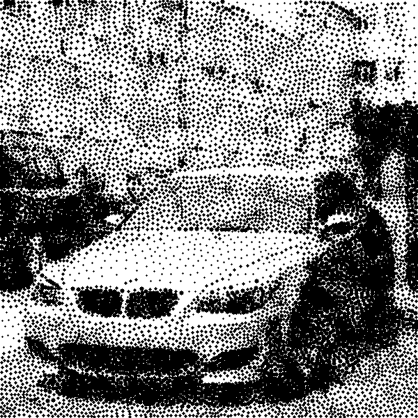
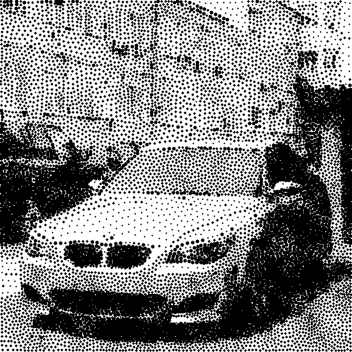

# Weighted Voronoi Stippling

A C++ implementation of weighted Voronoi stippling for the BUas programming homework (Y1Q0).

## Homework description

Authors: David Jones, Abhishek Biswas, Dave de Brueck and Jacco Bikker
```txt
We look forward to meeting you after the summer break! To make a smooth start, we ask you to consider the following carefully. Please come well-prepared!
It is important to Keep Coding. For this reason, we give you a small summer assignment. This is it:

“Create a program that draws a recognizable image of your face with no more than 64 lines.”
Obviously the program must be in C or C++. Apart from that: be clever about it.
We look forward to the best solutions on Day 1. Don’t come empty-handed.
```
Basically,
1. Program has to be <= 64 lines long and,
2. Program has to be made in C/C++.

## Layout

This repository is split into two branches.
1. `main` tracks the normal program, with comments
and a readable layout, including references to adapted code snippets and referenced
websites for ideas and/or implementations. ≈ 256 lines long.
2. `golf` branch tracks a line-shortened version of the main branch main.cpp file.
Makes the code completely unreadable, but meets the requirement of linecount for the homework assignment.
Naming inspired by the sport of golf, where scoring is based on lack of points. 64 lines long.

Repository is laid out as follows:
```
.run               CLion Run/Debug configurations
src/               C++ sources (main.cpp, Voronoi Stippling implementation)
lib/               Libraries used in the project
build/             Generated build tree
samples/           Sample input + stippled output images (used in this README)
CMakeLists.txt     Project definition
CMakePresets.json  Configure/build presets (Debug, Release)
documents/         Reference papers
```

## How it works

The program places black dots so their density follows the image's darkness, using
Adrian Secord's weighted Voronoi stippling method (see the paper in `documents/`).

1. **Darkness map.** The image is loaded with `stb_image`, where it is forced to RGB, stripping
the alpha channel. For each pixel, the REC.601 luminance is computed and then inverted,
giving a darkness weight in the range `[0, 1]`, where the dark pixels weigh the most.
2. **Seeding.** `--n` points are scattered by rejection sampling - a random pixel is accepted
only when its darkness beats a uniform random threshold, so darker regions attract
more points.
3. **Voronoi diagram.** The Voronoi cells of the seed points are built using `jc_voronoi`.
4. **Lloyd relaxation.** This is repeated `--iter` times. Each cell is rasterized, by its
centroid to edge triangle, to find the darkness weighted centroid. The darkness is accumulated
and each iteration the centroid moves closer to the darkest spot. This step helps out with
the initial random clumping, while still keeping points concentrated in the darker areas.
5. **Rendering.** Every final point is drawn as a filled black circle on a white canvas,
with the circle's radius proportional to the square root of `darkness`, so that a dot's
area scales linearly with darkness. The *maximum* radius is not a fixed pixel value; it is
derived from the average spacing between points, `√(W·H / N)`, so the dots automatically
scale with the image resolution and the point count `--n` instead of needing to be
hand-tuned per image.

## Prerequisites

- Visual Studio with the *Desktop development with C++* workload to provide
  the **MSVC compiler**
- **CMake 3.21+** (bundled with Visual Studio, or `winget install Kitware.CMake`).

Project takes special care to not specifically use a pre-determined generator, leaving CMake
to do the interpretative job of finding your compiler.

## Usage
Program uses `CLI11` library to parse input arguments. All arguments are required.
Here is a list of flags the program accepts:
* `--help` Prints all command line arguments and name of program.
* `--i` Input image, any format (if built using instructions below, relative to project root)
* `--o` Output image. Always written as BMP data, so give it a name ending in .bmp. Any other extension mislabels the file, and it may not open.
* `--iter` Number of Lloyd relaxing iterations to run (controls "evenness" of points in final image)
* `--n` Number of points to seed (If image is high resolution or final image lacks detail, increase). Also affects dot size: more points means tighter spacing, so dots are drawn smaller.

Program can use these parameters in any order.
Recommended values for `--iter` and `--n` are `40` and `10000` respectively.

Example usage:
```bash
./build/Debug/stippling.exe --i src/portrait.png --o out/portrait_stippled.bmp --iter 40 --n 10000
```

## Building

### From Command Line
1. Within the root directory of the project, run these commands:
```bash
cmake --preset default        # configure (generates build/ once)
cmake --build --preset debug  # compile -> build/Debug/stippling.exe
cmake --build --preset release  
```
2. Run the program:
```
build\[Chosen Preset]\stippling.exe --i [...] --o [... .bmp] --iter [x]  --n [y]
```

## Sample output

Produced with `--iter 40`. Note how the higher `--n` yields more, and correspondingly smaller, dots:

|                   Input                    |                 Stippled (`--n 5000`)                  |                  Stippled (`--n 10000`)                  |
|:------------------------------------------:|:------------------------------------------------------:|:--------------------------------------------------------:|
|  |  |  |
|          `samples/testImage.jpg`           |              `samples/stippled_n5000.png`              |              `samples/stippled_n10000.png`               |

### Effect of Lloyd relaxation

The same image at a fixed `--n 10000`, varying only `--iter`. The raw seeding is clumpy;
each relaxation pass spreads the points more evenly while preserving the overall density.
Note that the initial points are sampled randomly (`std::random_device`), so every run —
including the `--iter 0` frame — starts from a different layout; these are three independent
runs, not one evolving set of points:

|                 `--iter 0` (raw seeding)                  |                       `--iter 5`                       |                       `--iter 40`                        |
|:---------------------------------------------------------:|:------------------------------------------------------:|:--------------------------------------------------------:|
|  |  |  |
|               `samples/stippled_iter0.png`                |             `samples/stippled_iter5.png`               |              `samples/stippled_iter40.png`               |

## AI Usage disclosure

During this project the Claude Opus 4.8 model by Anthropic was used for some tasks.
All commits containing AI generated code or AI suggested bug fixes have been properly co-authored
and audited beforehand for correctness.
